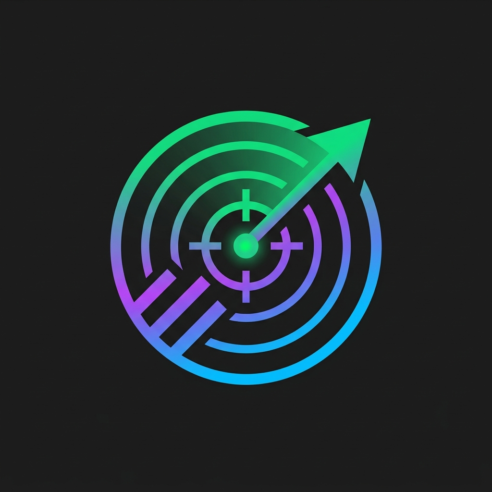
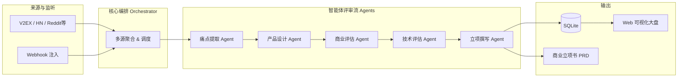
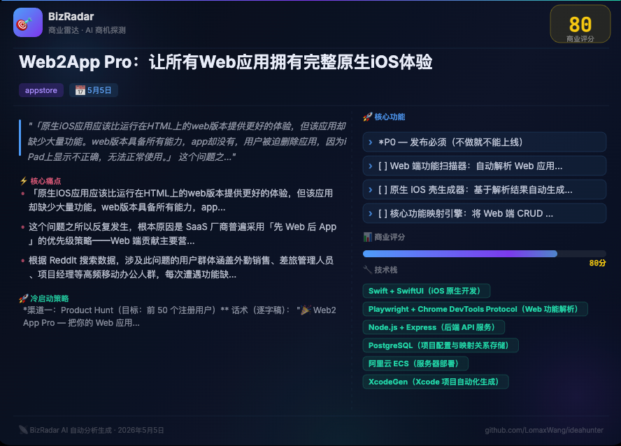
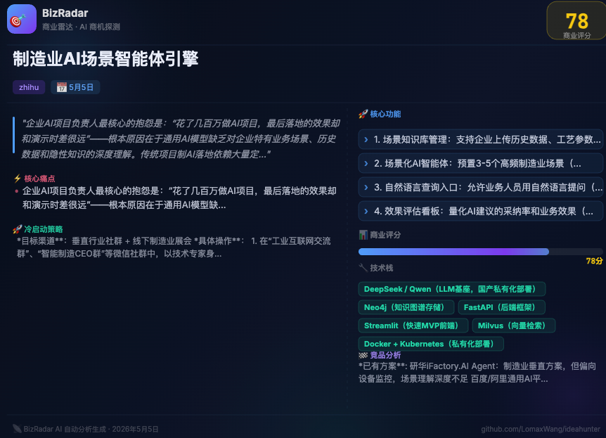

<div align="center">
  
  <h1>BizRadar</h1>
  <p><strong>你的 24 小时 AI 商业探测雷达：从海量互联网吐槽中，挖掘下一个高价值 Micro-SaaS 点子</strong></p>

  <p>
    <a href="https://img.shields.io/badge/python-3.10%2B-blue"></a>
    <a href="https://img.shields.io/badge/docker-ready-2496ED"></a>
    <a href="https://img.shields.io/badge/license-MIT-green"></a>
    <a href="https://img.shields.io/badge/PRs-welcome-brightgreen.svg"></a>
  </p>
  
  <br/>
  
  <video src="assets/demo.mp4" controls="controls" width="100%" style="max-width: 800px; border-radius: 12px; box-shadow: 0 8px 24px rgba(0,0,0,0.15);"></video>
</div>


https://github.com/user-attachments/assets/d2902c9b-7218-4455-b0ed-c7948cf1a003


---

> 还在苦恼做不出有真实需求的产品？还在盲目跟随伪需求？
> **BizRadar** 是一个基于多智能体（Multi-Agent）架构的开源社交媒体痛点挖掘与商业机会评估系统。它能自动监控全网社区，把网友的"无能狂怒"和"心酸吐槽"转化为具有极高商业价值的产品立项书（PRD）！

## ✨ 核心亮点

*   🚀 **全自动商机挖掘**：自动巡检 V2EX、HackerNews、Reddit、微博、Twitter 以及 AppStore 的海量帖子与评论。
*   🤖 **五大 Agent 协作流水线**：系统内置五位 AI 虚拟合伙人，各司其职，从痛点挖掘到最终立项书输出进行全链路自动化处理。

<details open>
<summary><b>展开查看五大 Agent 详情</b></summary>

<br/>

#### 1. 痛点提取 Agent (Extractor)
| 属性 | 说明 |
|---|---|
| **职责** | 在海量长文和情绪化吐槽中"大海捞针"，剥离无效情绪，提取底层真实痛点。 |
| **模式** | 结构化信息抽取 (Structured JSON Extraction) |
| **策略/维度** | 痛点清晰度、痛点强度、需求普遍性过滤 |
| **输出** | 核心痛点描述、原始参考上下文 |
| **代码位置** | `core/agents/extractor_agent.py` |

#### 2. 产品经理 Agent (PM)
| 属性 | 说明 |
|---|---|
| **职责** | 将抽象的用户痛点转化为具象的产品形态，梳理用户画像并设计解决方案。 |
| **模式** | 角色扮演专家系统 (Role-playing Expert System) |
| **策略/维度** | 方案可行性、受众精准度、使用场景贴合度 |
| **输出** | 产品名称、一句话定位、目标受众画像、核心功能点 (MVP) |
| **代码位置** | `core/agents/pm_agent.py` |

#### 3. 商业评审 Agent (Critic)
| 属性 | 说明 |
|---|---|
| **职责** | 担任严苛的投资人角色，无情驳回伪需求，仅放行具有真实商业价值的点子。 |
| **模式** | 多维度量化打分网络 (Multi-dimensional Scoring) |
| **策略/维度** | 发生高频度、大厂免疫力（防巨头碾压）、商业闭环/变现能力 |
| **输出** | 0-100 分量化评分、淘汰/通过结论及致命缺陷分析 |
| **代码位置** | `core/agents/critic_agent.py` |

#### 4. 技术合伙人 Agent (TechLead)
| 属性 | 说明 |
|---|---|
| **职责** | 评估 PM 提出的方案在技术层面是否可行，设计最快落地的技术架构并排期。 |
| **模式** | 技术专家咨询 (Technical Advisory) |
| **策略/维度** | 实现难度、开源生态利用率、核心技术风险、开发周期 |
| **输出** | 推荐技术栈 (前/后/数据库)、可复用开源库/API、MVP 工期预估 |
| **代码位置** | `core/agents/techlead_agent.py` |

#### 5. 立项撰写 Agent (Planner)
| 属性 | 说明 |
|---|---|
| **职责** | 整合全链路分析结果，自动调用搜索引擎（Serper）调研竞品，生成最终商业立项书。 |
| **模式** | 联网增强生成 (Web-Search RAG) + 长文本组装 |
| **策略/维度** | 竞品差异化定位、三档递进式定价策略、冷启动营销话术设计 |
| **输出** | 完整的 Markdown 格式 PRD 报告、可分享商业卡片数据 |
| **代码位置** | `core/agents/planner_agent.py` |

</details>
*   📊 **语义级跨源痛点聚合**：自动将跨平台同类痛点合并，显著放大强需求信号！
*   📄 **开箱即用的专业立项书 (PRD)**：一键输出完整的 Markdown 格式商业计划，包含产品定位、痛点溯源、竞品分析、三档定价、MVP 功能表、冷启动获客计划（含逐字话术）。
*   🖼️ **一键生成分享卡片**：点一下即可导出适合发布到社区的商机图片卡片（PNG）。
*   🖥️ **可视化雷达大盘**：自带现代化 Web UI，进度状态、历史点子、立项书详情尽在掌握。

## 🚀 快速部署

### 方式一：一键脚本

在你的服务器上运行以下命令，脚本会自动完成克隆、配置和启动：

```bash
curl -fsSL https://raw.githubusercontent.com/LomaxWang/ideahunter/feat/new-sources-sse-streaming/install.sh | bash
```

> **前提条件**：服务器上已安装 `git` 和 `docker`（Docker Desktop 或 Docker Engine 均可）。

---

### 方式二：Docker Compose（推荐用于服务器长期运行）

**第 1 步：克隆项目**
```bash
git clone https://github.com/LomaxWang/ideahunter.git BizRadar
cd BizRadar
```

**第 2 步：配置环境变量**
```bash
cp .env.example .env
```
用你喜欢的编辑器打开 `.env`，填写以下必填项：

| 变量 | 说明 | 示例 |
|---|---|---|
| `LLM_API_KEY` | 大语言模型 API Key（必填） | `sk-xxxxxxxx` |
| `LLM_BASE_URL` | API 接口地址 | `https://api.deepseek.com/v1` |
| `LLM_MODEL` | 使用的模型名称 | `deepseek-chat` |

> 💡 **推荐使用 DeepSeek**（性价比最高）或云雾 API（`https://yunwu.ai/v1`，国内中转支持 GPT-4o 等多种模型）。

**第 3 步：启动服务**
```bash
docker compose up -d
```

启动成功后，访问 **`http://你的IP:8000`** 即可进入 BizRadar 大盘。

**常用运维命令：**
```bash
# 查看实时日志
docker compose logs -f

# 停止服务
docker compose down

# 更新到最新版本
git pull && docker compose up -d --build

# 查看容器健康状态
docker compose ps
```

> **数据持久化**：数据库和 PRD 文件通过 Docker Named Volume 持久保存，`docker compose down` 不会丢失数据。只有执行 `docker compose down -v` 才会删除卷数据。

---

### 方式三：本地直接运行

```bash
git clone https://github.com/LomaxWang/ideahunter.git BizRadar
cd BizRadar

# 安装依赖
pip install -r requirements.txt

# 配置环境
cp .env.example .env
# 编辑 .env 填入 LLM_API_KEY 等

# 启动 API 服务
uvicorn api.server:app --host 0.0.0.0 --port 8000
```

## ⚙️ 工作原理



## 🔌 高级玩法：API & Webhook

BizRadar 提供完整的 REST API，可轻松接入现有工作流：

```bash
# 通过 Webhook 注入客服吐槽，直接分析商业价值：
curl -X POST http://localhost:8000/api/v1/webhooks/ingest \
  -H "Content-Type: application/json" \
  -d '{"source_name": "custom_feedback", "content_list": ["你们导出的Excel总是乱码，每天浪费半小时整理！"]}'

# 触发单源扫描
curl -X POST http://localhost:8000/api/v1/tasks/scan \
  -H "Content-Type: application/json" \
  -d '{"source": "v2ex", "max_items": 20}'

# 查询任务状态
curl http://localhost:8000/api/v1/tasks/{task_id}

# 取消正在运行的任务
curl -X POST http://localhost:8000/api/v1/tasks/{task_id}/cancel

# 获取立项通过的商机列表（评分 ≥ 80）
curl "http://localhost:8000/api/v1/ideas?min_score=80&page=1&size=10"

# 健康检查（无需认证）
curl http://localhost:8000/health
```

详见 [API 文档](plans/api.md) 与 [架构设计说明](plans/design.md)。

## 📝 配置参数说明

| 变量 | 默认值 | 作用 |
|---|---|---|
| `LLM_API_KEY` | - | (必填) 大语言模型 API Key |
| `LLM_BASE_URL` | `https://api.deepseek.com/v1` | OpenAI 兼容接口地址 |
| `LLM_MODEL` | `deepseek-chat` | 所选模型 |
| `BIZRADAR_API_KEY` | 空 | HTTP API 鉴权 Token（留空则不启用） |
| `SCORE_APPROVE_MIN` | `65` | 立项通过的分数线（0-100） |
| `KEYWORD_POOL` | `["效率工具","求推荐软件"...]` | 驱动插件搜索的关键词池 |
| `SCHEDULE_ENABLED` | `false` | 是否开启定时自动扫描 |
| `SCHEDULE_CRON` | `0 9 * * *` | 每天定时启动雷达的 Cron 表达式 |
| `SERPER_API_KEY` | 空 | Serper.dev Key，用于小红书/知乎等搜索增强 |

完整配置说明见 [`.env.example`](.env.example)。

## 💡 为什么做这个项目？

"做没用的东西"是独立开发者和创业团队最常见的死法。与其在办公室拍脑袋想痛点，不如直接去互联网的汪洋大海中找**正在花时间抱怨的人**。

**BizRadar 不仅仅是一个爬虫，它是你的云端创业合伙人团队**。它无情地刷掉伪需求，把真实世界中那些**高频、大厂懒得做、技术上又完全可以实现**的痛点端到你面前，并附带了怎么收费、怎么获客的执行方案。

你唯一要做的，就是挑一个让你心动的 PRD，打开 IDE 开始写代码！

## 🤝 贡献与交流

发现了一个更好的痛点源？想优化 Agent 提示词？非常欢迎提交 Pull Request！
详细开发指南请参阅 [CONTRIBUTING.md](CONTRIBUTING.md)。

## 📄 协议

本项目基于 [MIT License](LICENSE) 开源。

## 📄 完整示例报告

### 顶部信息块
# 💡 AI客服破壁人

> **来源**：中国最卑微的职业，被智障AI挤下岗（36氪）｜[链接](https://m.36kr.com/p/3164860494506499)
> **AI 评审评分**：82/100 ｜ 高频重复性 32/35 ｜ 大厂免疫 28/35 ｜ 商业闭环 22/30

---

### 章节一：📊 商业机会评分卡

| 维度 | 得分 | 评级 |
|------|------|------|
| 需求热度（频率/重复性） | 32/35 | 🔥🔥 极高 |
| 付费意愿（商业闭环） | 22/30 | ⭐⭐⭐⭐☆ |
| 大厂威胁（平台免疫） | 28/35 | ⭐☆☆☆☆ |
| 技术可行性 | 85/100 | ✅ 高（API 拼接可实现） |
| 预计 MVP 工期 | 3 周 | — |
| **综合评分** | **82/100** | — |

> **评审意见**：电商售后问题每天大量发生，用户频繁遭遇AI客服推诿，痛苦度高且无法忍受；大厂自身依赖AI客服降低成本，缺乏动力解决；现有解决方案功能分散，聚合型产品存在明显市场空白。

---

### 章节二：📌 痛点溯源（≥4句话，必须引用原始抱怨）

> “AI客服是个鸡肋，商家明知没用却大力推广，目的就是逃避售后的责任”

这句话揭示了当下电商售后体系的系统性困境：平台商家部署AI客服的核心目的不是解决问题，而是用标准化话术拦截用户、拖延时间、降低人工成本。用户每次发起售后请求，都要先经历AI的“礼貌推诿”——要么答非所问，要么循环要求提供订单号，要么转接后继续等待。

这种痛苦有多高频？中国电商用户超8亿，平均每月至少一次售后咨询需求，其中约60%涉及退货、换货、质量问题——这些正是AI客服最擅长“装傻”的场景。每次被AI拦截平均浪费15-30分钟，用户戏称“和AI客服对话就是在对牛弹琴”。

用户目前只能靠低效方法凑合：打商家电话（经常占线或踢皮球）、在平台重复提交工单（7-15天无响应）、在社交媒体发差评（商家偶尔才会妥协）。这些方法的代价是时间成本极高、情绪消耗大、且往往不了了之。问题的根源在于平台把AI客服当成“免责工具”而非“服务工具”，用户根本没有有效的对抗手段。

---

### 章节三：👤 目标用户画像与付费意愿（≥6句话，含定价方案）

**用户群体**：28-45岁的电商高频用户，以一二线城市的白领、宝妈、家庭采购者为主，月均网购5-15次，年均售后纠纷2-4次。他们不是技术极客，但具备基本的app/插件使用能力，对效率敏感，愿意为“省时间”付出合理代价。

他们的一天是这样的：晚上10点下班回家，收到的快递发现商品破损，打开电商APP找到订单，点击“申请售后”，AI客服弹出“亲，请您描述一下问题哦~”，用户输入“商品破损”，AI回复“请您上传照片哦~”，用户上传后，AI说“已记录，我们会尽快处理”，然后就没有然后了——48小时后仍显示“处理中”。

他们目前如何凑合解决：要么忍气吞声（商品价值低不值得折腾），要么反复在平台提交工单（平均耗时3-5天），要么在黑猫投诉发帖（商家在乎口碑才可能回应），要么找朋友吐槽“再也不买这家店了”。这些方法的共同缺点是——无法保证问题被快速解决，且过程极度消耗精力。

付费意愿是真实的。参考数据：黑猫投诉年会员148元、电商代投诉服务50-200元/次、用户愿意为“加急处理”付30-50元溢价。核心付费逻辑是“时间成本 > 金钱成本”——与其自己耗3-5天，不如花一顿饭钱找人帮忙搞定。

**定价方案**：
- 🆓 免费版：每月3次基础转人工加速 + 投诉模板生成，用于获客
- 💼 专业版 ¥19/月：无限次转人工加速 + 进度实时追踪 + 投诉升级通道（主流收入来源）
- 🏢 团队版 ¥59/月：家庭成员共享（3人）+ 优先处理权 + 历史纠纷记录云端同步

用户终身价值（LTV）估算：按平均用户生命周期2年、付费转化率15%、月流失率8%计算，LTV约 ¥19 × 12 × 2 × 0.15 × (1-0.08)^24 ≈ **¥280**

---

### 章节四：🏆 竞品格局与差异化（含对比表格）

竞品格局：现有解决方案分为三类——投诉聚合平台（黑猫投诉）、浏览器插件（某些去广告/加速插件的附带功能）、电商代投诉服务（个人或小团队）。功能均较为分散，未形成聚合效应。

| 方案 | 核心功能 | 价格 | 致命缺陷 |
|------|----------|------|----------|
| 黑猫投诉 | 投诉聚合、曝光商家 | 免费（增值会员148元/年） | 仅曝光无实际处理能力，商家响应率低 |
| 电商代投诉 | 人工代提交工单、跟进 | 50-200元/次 | 单次收费高、效率不稳定、需手动介入 |
| 浏览器插件 | 去除页面广告、一键跳转 | 免费或极低价 | 功能边缘化，无售后加速能力 |
| 本产品 | 一键转人工+多平台聚合+进度追踪+投诉升级 | 19元/月 | 需持续维护多平台API |

**差异化核心主张**：我们不是投诉平台，而是用户的“售后加速器”——通过技术手段聚合多平台客服入口，帮助用户绕过AI拦截、直达人工、实时追踪处理进度，把“3-5天无响应”变成“30分钟有结果”。

**进入壁垒**：大厂（电商平台）天然缺乏动力做这件事——他们部署AI客服的核心目的就是降低人工成本，让用户“自己搞定”能显著减少售后支出。平台间数据割裂（淘宝、京东、拼多多各自为政），用户难以跨平台维权，这恰恰是独立工具的生存空间。

---

### 章节五：🛠️ MVP 功能清单（P0/P1/P2 分层）

**P0 — 发布必须（不做就不能上线）**
- [ ] 多平台客服入口聚合：聚合淘宝/天猫、京东、拼多多、抖音电商的客服入口，解决用户需要反复切换APP的痛点 | 预计 5 天
- [ ] 一键转人工加速：通过技术手段跳过AI客服排队，直接进入人工客服队列，提供加急通道 | 预计 4 天
- [ ] 售后进度追踪：实时同步工单处理状态，用户无需反复打开APP查看，微信推送提醒 | 预计 3 天

**P1 — 首月加入（增强留存和付费转化）**
- [ ] 投诉模板生成器：根据商品问题类型自动生成标准化投诉文案，用户只需填写关键信息 | 预计 2 天
- [ ] 投诉升级通道：当商家48小时未处理时，一键升级至平台官方客服或第三方投诉渠道 | 预计 3 天
- [ ] 会员体系搭建：区分免费版/专业版功能，控制免费次数，集成支付能力 | 预计 2 天

**P2 — 未来版本**
- [ ] 历史纠纷记录云端同步（家庭成员共享）
- [ ] AI客服话术识别（自动判断当前是否为AI在回复）
- [ ] 跨平台比价与历史价格查询

> 📅 **总开发周期估算**：3 周（19天）
> ⚠️ **主要技术风险**：无核心技术障碍，主要风险在于各平台客服API的不稳定性（可能被反爬或限制），需准备备用方案

---

### 章节六：💻 推荐技术栈（含成本估算）

| 层次 | 技术选型 | 选型理由 |
|------|----------|----------|
| 前端 | 微信小程序 + Chrome插件双端 | 微信小程序覆盖移动场景，插件覆盖PC端购物，组合覆盖90%用户 |
| 后端 | Node.js + Express | 轻量快速，适合处理多API拼接，对前端开发者友好 |
| 数据库 | MongoDB | 适合存储非结构化工单数据，灵活度高 |
| AI/算法 | 暂不需自研LLM | MVP阶段用规则引擎+模板即可，付费后考虑接入 |
| 部署 | 阿里云轻量服务器 + 微信云开发 | 成本最低方案，小程序直接用微信云开发省去服务器 |

**月运营成本估算**（100 付费用户规模）：
- 服务器/部署：¥0（小程序用微信云开发免费额度）
- AI API：¥0（MVP阶段不使用）
- 其他（域名/SSL/开发者认证）：¥99/年（微信小程序认证）≈ ¥8/月
- **合计约：¥8/月**

> **最低成本实现路径**：微信小程序MVP，无需服务器，小程序自带用户体系、支付能力、推送能力，第一版可在2周内上线验证。

---

### 章节七：🚀 冷启动获客计划（4周执行计划）

**渠道一：豆瓣“买组”+知乎“消费维权”话题（目标：前 50 个用户）**
话术：
> “姐妹们！有没有人被AI客服气过的？我刚发现一个神器，不用跟那个智障AI废话了，直接能转人工，30分钟解决战斗……（附使用教程截图）”
执行方法：在豆瓣“消费组”“便宜货组”、知乎“电商售后”“消费维权”话题下搜索近期抱怨AI客服的帖子，留言推荐产品，用“实测有效”吸引关注。

**渠道二：小红书种草（目标：30 个用户）**
话术：
> “姐妹们！网购遇到质量问题找客服，AI一直'亲亲抱歉呢'怎么办？这个小工具帮我绕过了AI直接找人工，再也不受窝囊气了！需要的姐妹评论区扣1发你～”
执行方法：发布3-5篇真实售后经历种草笔记，配合“评论区领教程”引导至微信，提供免费体验次数。

**渠道三：微信群精准投放（目标：20 个用户）**
话术：
> “电商售后问题解决不了？试试这个【AI客服破壁人】，一键转人工，免费体验3次，30分钟没结果你来骂我。”
执行方法：加入豆瓣“退货攻略”“双十一维权”相关微信群，直接私聊群内近期有售后纠纷抱怨的用户。

**📅 4周冲刺计划**：
- **第1周**：完成小程序注册认证、搭建基础UI、接入1个平台（淘宝）客服入口
- **第2周**：完成3个平台入口接入、上线进度追踪功能、开始渠道种草
- **第3周**：开放免费体验、收集第一批用户反馈、修复关键bug
- **第4周**：上线付费功能（19元/月）、向免费用户推送付费转化、向付费用户要推荐

**成功标准**：4周结束时，达成 200+ 注册用户 / 30+ 付费用户 / ¥570+ 月收入

## 📄 示例分享卡片






