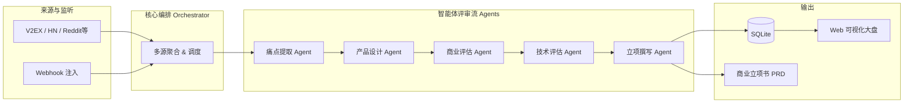

<div align="center">
  
  <h1>BizRadar</h1>
  <p><strong>你的 24 小时 AI 商业探测雷达：从海量互联网吐槽中，挖掘下一个高价值 Micro-SaaS 点子</strong></p>

  <p>
    <a href="https://img.shields.io/badge/python-3.10%2B-blue"></a>
    <a href="https://img.shields.io/badge/docker-ready-2496ED"></a>
    <a href="https://img.shields.io/badge/license-MIT-green"></a>
    <a href="https://img.shields.io/badge/PRs-welcome-brightgreen.svg"></a>
  <br/>
  <video controls width="100%">
    <source src="./assets/demo.mp4" type="video/mp4">
  </video>
</div>


https://github.com/user-attachments/assets/d2902c9b-7218-4455-b0ed-c7948cf1a003


---

> 还在苦恼做不出有真实需求的产品？还在盲目跟随伪需求？
> **BizRadar** 是一个基于多智能体（Multi-Agent）架构的开源社交媒体痛点挖掘与商业机会评估系统。它能自动监控全网社区，把网友的"无能狂怒"和"心酸吐槽"转化为具有极高商业价值的产品立项书（PRD）！

## ✨ 核心亮点

*   🚀 **全自动商机挖掘**：自动巡检 V2EX、HackerNews、Reddit、微博、Twitter 以及 AppStore 的海量帖子与评论。
*   🤖 **四大 Agent 协作评审**：
    *   **提取员 (Extractor)**：大海捞针，精准识别真正的"用户痛点"。
    *   **产品经理 (PM)**：梳理需求，构建用户画像与使用场景。
    *   **商业评审 (Critic)**：残酷打分，从高频度、大厂免疫力、商业闭环三大维度砍掉"伪需求"。
    *   **技术合伙人 (TechLead)**：评估技术可行性、把控核心技术风险、估算 MVP 工期。
*   📊 **语义级跨源痛点聚合**：自动将跨平台同类痛点合并，显著放大强需求信号！
*   📄 **开箱即用的专业立项书 (PRD)**：一键输出完整的 Markdown 格式商业计划，包含产品定位、痛点溯源、竞品分析、三档定价、MVP 功能表、冷启动获客计划（含逐字话术）。
*   🖼️ **一键生成分享卡片**：点一下即可导出适合发布到社区的商机图片卡片（PNG）。
*   🖥️ **可视化雷达大盘**：自带现代化 Web UI，进度状态、历史点子、立项书详情尽在掌握。

## 🚀 快速部署

### 方式一：一键脚本

在你的服务器上运行以下命令，脚本会自动完成克隆、配置和启动：

```bash
curl -fsSL https://raw.githubusercontent.com/LomaxWang/ideahunter/feat/new-sources-sse-streaming/install.sh | bash
```

> **前提条件**：服务器上已安装 `git` 和 `docker`（Docker Desktop 或 Docker Engine 均可）。

---

### 方式二：Docker Compose（推荐用于服务器长期运行）

**第 1 步：克隆项目**
```bash
git clone https://github.com/LomaxWang/ideahunter.git BizRadar
cd BizRadar
```

**第 2 步：配置环境变量**
```bash
cp .env.example .env
```
用你喜欢的编辑器打开 `.env`，填写以下必填项：

| 变量 | 说明 | 示例 |
|---|---|---|
| `LLM_API_KEY` | 大语言模型 API Key（必填） | `sk-xxxxxxxx` |
| `LLM_BASE_URL` | API 接口地址 | `https://api.deepseek.com/v1` |
| `LLM_MODEL` | 使用的模型名称 | `deepseek-chat` |

> 💡 **推荐使用 DeepSeek**（性价比最高）或云雾 API（`https://yunwu.ai/v1`，国内中转支持 GPT-4o 等多种模型）。

**第 3 步：启动服务**
```bash
docker compose up -d
```

启动成功后，访问 **`http://你的IP:8000`** 即可进入 BizRadar 大盘。

**常用运维命令：**
```bash
# 查看实时日志
docker compose logs -f

# 停止服务
docker compose down

# 更新到最新版本
git pull && docker compose up -d --build

# 查看容器健康状态
docker compose ps
```

> **数据持久化**：数据库和 PRD 文件通过 Docker Named Volume 持久保存，`docker compose down` 不会丢失数据。只有执行 `docker compose down -v` 才会删除卷数据。

---

### 方式三：本地直接运行

```bash
git clone https://github.com/LomaxWang/ideahunter.git BizRadar
cd BizRadar

# 安装依赖
pip install -r requirements.txt

# 配置环境
cp .env.example .env
# 编辑 .env 填入 LLM_API_KEY 等

# 启动 API 服务
uvicorn api.server:app --host 0.0.0.0 --port 8000
```

## ⚙️ 工作原理



## 🔌 高级玩法：API & Webhook

BizRadar 提供完整的 REST API，可轻松接入现有工作流：

```bash
# 通过 Webhook 注入客服吐槽，直接分析商业价值：
curl -X POST http://localhost:8000/api/v1/webhooks/ingest \
  -H "Content-Type: application/json" \
  -d '{"source_name": "custom_feedback", "content_list": ["你们导出的Excel总是乱码，每天浪费半小时整理！"]}'

# 触发单源扫描
curl -X POST http://localhost:8000/api/v1/tasks/scan \
  -H "Content-Type: application/json" \
  -d '{"source": "v2ex", "max_items": 20}'

# 查询任务状态
curl http://localhost:8000/api/v1/tasks/{task_id}

# 取消正在运行的任务
curl -X POST http://localhost:8000/api/v1/tasks/{task_id}/cancel

# 获取立项通过的商机列表（评分 ≥ 80）
curl "http://localhost:8000/api/v1/ideas?min_score=80&page=1&size=10"

# 健康检查（无需认证）
curl http://localhost:8000/health
```

详见 [API 文档](plans/api.md) 与 [架构设计说明](plans/design.md)。

## 📝 配置参数说明

| 变量 | 默认值 | 作用 |
|---|---|---|
| `LLM_API_KEY` | - | (必填) 大语言模型 API Key |
| `LLM_BASE_URL` | `https://api.deepseek.com/v1` | OpenAI 兼容接口地址 |
| `LLM_MODEL` | `deepseek-chat` | 所选模型 |
| `BIZRADAR_API_KEY` | 空 | HTTP API 鉴权 Token（留空则不启用） |
| `SCORE_APPROVE_MIN` | `65` | 立项通过的分数线（0-100） |
| `KEYWORD_POOL` | `["效率工具","求推荐软件"...]` | 驱动插件搜索的关键词池 |
| `SCHEDULE_ENABLED` | `false` | 是否开启定时自动扫描 |
| `SCHEDULE_CRON` | `0 9 * * *` | 每天定时启动雷达的 Cron 表达式 |
| `SERPER_API_KEY` | 空 | Serper.dev Key，用于小红书/知乎等搜索增强 |

完整配置说明见 [`.env.example`](.env.example)。

## 💡 为什么做这个项目？

"做没用的东西"是独立开发者和创业团队最常见的死法。与其在办公室拍脑袋想痛点，不如直接去互联网的汪洋大海中找**正在花时间抱怨的人**。

**BizRadar 不仅仅是一个爬虫，它是你的云端创业合伙人团队**。它无情地刷掉伪需求，把真实世界中那些**高频、大厂懒得做、技术上又完全可以实现**的痛点端到你面前，并附带了怎么收费、怎么获客的执行方案。

你唯一要做的，就是挑一个让你心动的 PRD，打开 IDE 开始写代码！

## 🤝 贡献与交流

发现了一个更好的痛点源？想优化 Agent 提示词？非常欢迎提交 Pull Request！
详细开发指南请参阅 [CONTRIBUTING.md](CONTRIBUTING.md)。

## 📄 协议

本项目基于 [MIT License](LICENSE) 开源。
