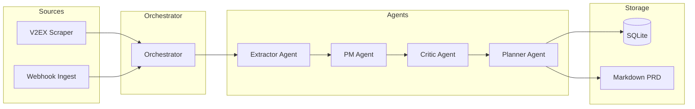

# BizRadar


Business radar agent: extract pain-points from community discussions, run multi-agent review, and produce micro-PRDs automatically.

Built-in data source: `v2ex`. Supports injecting external text via webhook.

For detailed product spec see [plans/intro.md](plans/intro.md), [plans/rfc.md](plans/rfc.md), architecture in [plans/design.md](plans/design.md), HTTP API in [plans/api.md](plans/api.md).

## Architecture



Raw items flow from **scrapers** into the **orchestrator**, which passes each item through four LLM agents sequentially:

1. **Extractor** -- identifies whether the post contains a genuine pain-point.
2. **PM** -- formulates a user story and persona.
3. **Critic** -- scores the idea (0-100) and notes competitors.
4. **Planner** -- produces a full micro-PRD (Markdown) for ideas scoring above 80.

Results are persisted to **SQLite** and written as **Markdown PRD** files.

## Quick Start

```bash
cd BizRadar
pip install -r requirements.txt
cp .env.example .env
# Edit .env: set LLM_API_KEY, LLM_BASE_URL, LLM_MODEL
```

### CLI Usage

```bash
# Default: scan V2EX, daily report mode
python main.py --target v2ex --mode daily_report

# Limit to 20 items, filter by keywords
python main.py --target v2ex --max-items 20 --keywords SaaS AI

# Output goes to:
#   SQLite:  data/ideahunter.db
#   PRDs:    output/
```

### HTTP API

```bash
# Start the API server
uvicorn api.server:app --host 0.0.0.0 --port 8000
```

Base URL: `http://localhost:8000/api/v1`. If `IDEAHUNTER_API_KEY` is set, requests require `Authorization: Bearer <key>`.

**Example requests:**

```bash
# Trigger a V2EX scan
curl -X POST http://localhost:8000/api/v1/tasks/scan \
  -H "Content-Type: application/json" \
  -H "Authorization: Bearer YOUR_KEY" \
  -d '{"source": "v2ex", "max_items": 10}'

# Inject external text via webhook
curl -X POST http://localhost:8000/api/v1/webhooks/ingest \
  -H "Content-Type: application/json" \
  -H "Authorization: Bearer YOUR_KEY" \
  -d '{"source_name": "custom", "content_list": ["Users complain about slow dashboards..."]}'

# Check task progress
curl http://localhost:8000/api/v1/tasks/tsk_abc123 \
  -H "Authorization: Bearer YOUR_KEY"

# List approved ideas (min score 80, page 1)
curl "http://localhost:8000/api/v1/ideas?min_score=80&page=1&size=10" \
  -H "Authorization: Bearer YOUR_KEY"

# Get full idea details
curl http://localhost:8000/api/v1/ideas/IDEA_ID \
  -H "Authorization: Bearer YOUR_KEY"

# Health check (no auth required)
curl http://localhost:8000/health
```

### Docker

```bash
# Build and run
docker compose up -d

# Or build manually
docker build -t bizradar .
docker run -p 8000:8000 --env-file .env -v ./data:/app/data -v ./output:/app/output bizradar
```

## Configuration Reference

| Variable | Default | Description |
|---|---|---|
| `LLM_API_KEY` | (required) | API key for the LLM provider |
| `LLM_BASE_URL` | `https://api.openai.com/v1` | OpenAI-compatible API base URL |
| `LLM_MODEL` | `gpt-4o-mini` | Model name to use for all agents |
| `IDEAHUNTER_API_KEY` | (empty) | Bearer token for HTTP API auth (optional) |
| `IDEAHUNTER_SQLITE_PATH` | `data/ideahunter.db` | Path to SQLite database |
| `OUTPUT_DIR` | `output` | Directory for generated PRD files |
| `SCHEDULE_ENABLED` | `false` | Enable APScheduler background cron |
| `SCHEDULE_CRON` | `0 9 * * *` | Cron expression for scheduled runs |
| `SCHEDULE_SOURCES` | `["v2ex"]` | JSON list of sources to scan on schedule |

## Development

```bash
# Install dev dependencies
pip install -e ".[dev]"

# Lint
ruff check .

# Run tests
pytest

# Type check
mypy core/ api/ plugins/
```

See [CONTRIBUTING.md](CONTRIBUTING.md) for detailed contribution guidelines.

## License

[MIT](LICENSE)
