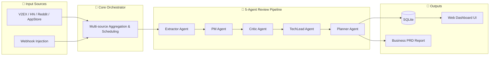

<div align="center">
  
  <h1>BizRadar</h1>
  <p><strong>Your 24/7 AI Business Radar: Mining the next high-value Micro-SaaS idea from millions of online complaints</strong></p>

  <p>
    <a href="https://img.shields.io/badge/python-3.10%2B-blue"></a>
    <a href="https://img.shields.io/badge/docker-ready-2496ED"></a>
    <a href="https://img.shields.io/badge/license-MIT-green"></a>
    <a href="https://img.shields.io/badge/PRs-welcome-brightgreen.svg"></a>
  </p>

  <br/>

  <video src="assets/demo.mp4" controls="controls" width="100%" style="max-width: 800px; border-radius: 12px; box-shadow: 0 8px 24px rgba(0,0,0,0.15);"></video>
</div>

https://github.com/user-attachments/assets/d2902c9b-7218-4455-b0ed-c7948cf1a003

> 🇨🇳 **[中文文档 (Chinese README)](README.md)**

---

> Still struggling to build products that people actually want? Tired of chasing fake demand?
> **BizRadar** is an open-source, Multi-Agent-powered social media pain point mining and business opportunity evaluation system. It automatically monitors online communities, transforming users' "frustrated rants" and "heartfelt complaints" into high-value Product Requirement Documents (PRDs)!

## ✨ Key Features

*   🚀 **Fully Automated Opportunity Mining**: Automatically scans V2EX, HackerNews, Reddit, Weibo, Twitter, and AppStore for millions of posts and reviews.
*   🤖 **5-Agent Collaborative Pipeline**: Five specialized AI virtual co-founders work in sequence, handling everything from pain point extraction to final PRD generation.

<details open>
<summary><b>Expand to see the 5 Agent details</b></summary>

<br/>

#### 1. Extractor Agent
| Attribute | Description |
|---|---|
| **Role** | Finds the needle in the haystack — strips away emotional noise and extracts the core underlying pain point. |
| **Mode** | Structured JSON Extraction |
| **Strategy/Dimensions** | Pain point clarity, pain point intensity, demand universality filtering |
| **Output** | Core pain point description, original reference context |
| **Code Location** | `core/agents/extractor_agent.py` |

#### 2. PM Agent (Product Manager)
| Attribute | Description |
|---|---|
| **Role** | Transforms abstract pain points into concrete product shapes, defines user personas, and designs solutions. |
| **Mode** | Role-playing Expert System |
| **Strategy/Dimensions** | Solution feasibility, audience precision, use-case alignment |
| **Output** | Product name, one-liner positioning, target user persona, core MVP features |
| **Code Location** | `core/agents/pm_agent.py` |

#### 3. Critic Agent (Business Reviewer)
| Attribute | Description |
|---|---|
| **Role** | Acts as a ruthless investor — rejects fake demand without mercy, only approving ideas with genuine commercial value. |
| **Mode** | Multi-dimensional Scoring Network |
| **Strategy/Dimensions** | Occurrence frequency, big-tech immunity (anti-giant moat), business model / monetization viability |
| **Output** | 0-100 quantitative score, pass/fail verdict with fatal flaw analysis |
| **Code Location** | `core/agents/critic_agent.py` |

#### 4. TechLead Agent (Technical Co-founder)
| Attribute | Description |
|---|---|
| **Role** | Assesses technical feasibility of the PM's plan, designs the fastest-to-market architecture, and creates a project timeline. |
| **Mode** | Technical Advisory |
| **Strategy/Dimensions** | Implementation complexity, open-source ecosystem leverage, core technical risks, development timeline |
| **Output** | Recommended tech stack (frontend/backend/database), reusable open-source libraries/APIs, MVP timeline estimate |
| **Code Location** | `core/agents/techlead_agent.py` |

#### 5. Planner Agent
| Attribute | Description |
|---|---|
| **Role** | Synthesizes all pipeline results, auto-queries search engines (Serper) to research competitors, and generates the final business brief. |
| **Mode** | Web-Search RAG + Long-form Document Assembly |
| **Strategy/Dimensions** | Competitor differentiation positioning, 3-tier progressive pricing strategy, cold-start marketing copy |
| **Output** | Complete Markdown-format PRD report, shareable business opportunity card data |
| **Code Location** | `core/agents/planner_agent.py` |

</details>

*   📊 **Semantic Cross-Source Pain Point Aggregation**: Automatically merges similar pain points across platforms, significantly amplifying strong demand signals!
*   📄 **Out-of-the-Box Professional PRD**: One-click output of a complete Markdown business plan, including product positioning, pain point tracing, competitive analysis, 3-tier pricing, MVP feature list, and a cold-start acquisition plan (with word-for-word scripts).
*   🖼️ **One-Click Shareable Cards**: Export polished business opportunity image cards (PNG) ready to share in communities.
*   🖥️ **Visual Radar Dashboard**: A modern Web UI to track progress, review past ideas, and browse full PRD details.

## 🚀 Quick Deployment

### Option 1: One-Click Script

Run the following command on your server, and the script will automatically clone, configure, and start the service:

```bash
curl -fsSL https://raw.githubusercontent.com/LomaxWang/BizRadar/main/install.sh | bash
```

> **Prerequisites**: `git` and `docker` must be installed on your server (Docker Desktop or Docker Engine both work).

---

### Option 2: Docker Compose (Recommended for long-term server deployment)

**Step 1: Clone the project**
```bash
git clone https://github.com/LomaxWang/BizRadar.git
cd BizRadar
```

**Step 2: Configure environment variables**
```bash
cp .env.example .env
```
Open `.env` with your editor and fill in the required fields:

| Variable | Description | Example |
|---|---|---|
| `LLM_API_KEY` | LLM API Key (required) | `sk-xxxxxxxx` |
| `LLM_BASE_URL` | API endpoint URL | `https://api.openai.com/v1` |
| `LLM_MODEL` | Model name to use | `gpt-4o-mini` |

> 💡 **Recommended**: DeepSeek (best cost-efficiency) or any OpenAI-compatible API endpoint.

**Step 3: Start the service**
```bash
docker compose up -d
```

Once started, visit **`http://your-ip:8000`** to access the BizRadar dashboard.

**Common maintenance commands:**
```bash
# View real-time logs
docker compose logs -f

# Stop the service
docker compose down

# Update to the latest version
git pull && docker compose up -d --build

# Check container health status
docker compose ps
```

> **Data Persistence**: The database and PRD files are persisted via Docker Named Volumes. Running `docker compose down` will NOT delete your data. Only `docker compose down -v` will remove volume data.

---

### Option 3: Run Locally (No Docker)

```bash
git clone https://github.com/LomaxWang/BizRadar.git
cd BizRadar

# Install dependencies
pip install -r requirements.txt

# Configure environment
cp .env.example .env
# Edit .env and fill in LLM_API_KEY, etc.

# Start the API service
uvicorn api.server:app --host 0.0.0.0 --port 8000
```

## ⚙️ How It Works



## 🔌 Advanced Usage: API & Webhooks

BizRadar provides a complete REST API, making it easy to integrate into existing workflows:

```bash
# Inject custom feedback via Webhook for direct business analysis:
curl -X POST http://localhost:8000/api/v1/webhooks/ingest \
  -H "Content-Type: application/json" \
  -d '{"source_name": "custom_feedback", "content_list": ["Your Excel export always corrupts the encoding, wasting 30 minutes every day!"]}'

# Trigger a single-source scan
curl -X POST http://localhost:8000/api/v1/tasks/scan \
  -H "Content-Type: application/json" \
  -d '{"source": "hackernews", "max_items": 20}'

# Query task status
curl http://localhost:8000/api/v1/tasks/{task_id}

# Cancel a running task
curl -X POST http://localhost:8000/api/v1/tasks/{task_id}/cancel

# Get approved business ideas (score ≥ 80)
curl "http://localhost:8000/api/v1/ideas?min_score=80&page=1&size=10"

# Health check (no auth required)
curl http://localhost:8000/health
```

See [API Documentation](plans/api.md) and [Architecture Design](plans/design.md) for more details.

## 📝 Configuration Reference

| Variable | Default | Description |
|---|---|---|
| `LLM_API_KEY` | — | **(Required)** LLM API Key |
| `LLM_BASE_URL` | `https://api.openai.com/v1` | OpenAI-compatible API endpoint |
| `LLM_MODEL` | `gpt-4o-mini` | Model to use |
| `BIZRADAR_API_KEY` | empty | HTTP API authentication token (disabled if empty) |
| `SCORE_APPROVE_MIN` | `65` | Minimum score threshold for approving an idea (0–100) |
| `KEYWORD_POOL` | `["productivity tools","software recommendation"...]` | Keyword pool driving the search |
| `SCHEDULE_ENABLED` | `false` | Enable scheduled automatic scanning |
| `SCHEDULE_CRON` | `0 9 * * *` | Cron expression for daily radar activation |
| `SERPER_API_KEY` | empty | Serper.dev key for search-augmented competitor research |

See [`.env.example`](.env.example) for the complete configuration reference.

## 💡 Why We Built This

"Building something nobody wants" is the most common way indie developers and startup teams fail. Instead of brainstorming in the office, why not go directly to the internet's ocean of complaints and find **people who are actively spending their time complaining**?

**BizRadar is not just a web scraper — it's your cloud-based startup co-founder team.** It ruthlessly filters out fake demand and surfaces pain points that are **high-frequency, immune to big-tech disruption, and technically achievable** — complete with a monetization plan and a customer acquisition playbook.

All you have to do is pick a PRD that excites you and open your IDE.

## 📄 Example Report & Shareable Cards

Below are example shareable opportunity cards generated by BizRadar:


## 🤝 Contributing

Found a better pain point source? Want to improve an Agent's prompt? Pull Requests are warmly welcome!
Please refer to [CONTRIBUTING.md](CONTRIBUTING.md) for the development guide.

## 📄 License

This project is open-sourced under the [MIT License](LICENSE).
