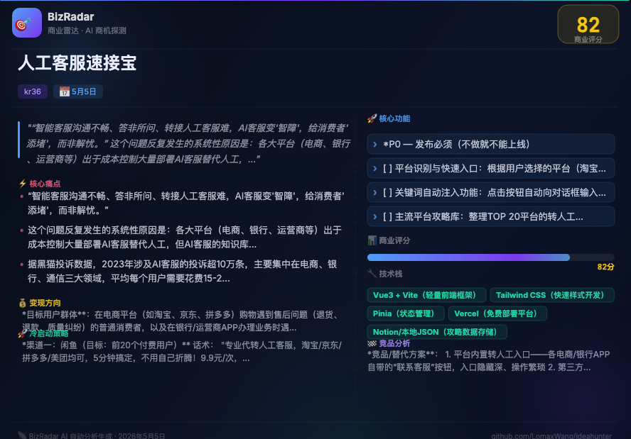

# 我开源了一个 AI 商业雷达，专门把网上的「吐槽」变成创业项目

---

> **说明：** 这是一份经过平衡的推广文案，既保证了吸引力（说明了能解决什么痛点、展示了酷炫的功能），又去除了容易触发社区审核的过度营销词汇（如“榨干”、“金矿”等）。适合发布在 V2EX、掘金、少数派等主流开发者平台。

---

## 🇨🇳 中文版（V2EX / 即刻 / 掘金 / 少数派）

---

**标题：** 我做了个开源工具，把 V2EX/小红书/Reddit... 上的「吐槽帖」自动分析成可以直接开干的产品方案

---

大家好，做独立开发或者运作“一人公司”有一段时间了。我发现最痛苦的往往不是写不出代码，而是花几个月时间做出来的东西，上线后根本没人用。很多时候我们都是在“拍脑袋”想需求。

但实际上，真实的需求每天都藏在各大社区的吐槽帖里。比如在 V2EX、Reddit 上，经常有人抱怨“为什么没有一个工具能解决 xxx 问题”，这些抱怨背后其实就是最真实的痛点。

为了系统性地解决“该做啥产品”的问题，我开发了一个基于大模型的开源工具 —— **BizRadar (商业雷达)**。

### 🛠️ 它是怎么工作的？

BizRadar 并不是一个简单的玩具，而是一个具有实际商业价值的开源多 Agent 系统。它会自动去各大社区抓取帖子，然后通过内置的 **5 个专业 AI Agent** 进行全链路的商业价值验证：

1. **痛点提取 Agent**：自动降噪，过滤掉水贴和单纯的情绪发泄，只提取帖子里的客观痛点。
2. **产品经理 Agent**：根据痛点梳理目标用户画像，并构思出具象的产品功能点。
3. **商业评审 Agent**：这一步帮我避开了很多坑。它会评估这个需求是不是太低频？是不是大厂顺手就能做？如果太容易被巨头碾压，点子就会被直接淘汰。
4. **技术合伙人 Agent**：结合前面提取的需求，给出一个大概的技术栈建议和 MVP（最小可行性产品）的开发工期评估。
5. **立项撰写 Agent**：最后一步，调用搜索引擎查一下市面上的竞品，然后把上面的分析整理成一份完整的 Markdown 格式商业立项书。

### 🎯 跑出来的实际效果与“商机分享卡片”

光说逻辑可能有点抽象。比如刚好最近网上很多人吐槽“电商平台的 AI 客服一直在绕圈子，根本不解决问题”。

BizRadar 捕捉到这个信号后，不仅生成了非常详细的商业立项报告（分析了代投诉工具太贵的局限性，给出了一套“小程序+插件”的解决方案和定价建议），**它还会自动为你生成一张精美的商机分享卡片**：



*(图注：BizRadar 自动生成的商业机会卡片，一目了然地展示痛点核心与各项商业评估得分)*

通过这种直观的卡片，你可以非常方便地记录自己的创业灵感，或者把点子发到社区里跟其他开发者讨论。

### 🤝 为什么要开源？

独立开发者和一人公司最缺的，往往就是一个专业的“合伙人团队”来帮忙做前期的市场调研和商业论证。这个工具现在每天在我的服务器上跑着，帮我寻找有价值的用户痛点。

开源出来，是希望能帮助更多像我一样经常为找需求发愁的开发者。同时，也希望借助开源社区的力量一起改进 Agent 的提示词，或者加入更多的数据源。目前的 Agent 评分逻辑还需要不断调优。

如果你对大模型的 Multi-Agent 实际落地感兴趣，或者正愁没有产品思路，不妨跑起来试试。

**部署非常简单，一行 Docker 命令：**

```bash
docker compose up -d
```

**⭐ GitHub 传送门：** [https://github.com/LomaxWang/BizRadar](https://github.com/LomaxWang/BizRadar)

没有任何收费环节。如果你觉得这套通过多 Agent 挖掘商业想法的思路对你有帮助，**欢迎给个 Star 支持一下**；如果有老哥愿意提 PR 一起改进，那就再好不过了！

---

---

## 🇺🇸 英文版（Reddit r/SideProject / r/entrepreneur / Hacker News）

---

**Title:** I built an open-source "Cyber Co-founder" that turns Reddit/HN complaints into fully fleshed-out startup ideas!

---

The hardest part of being an indie hacker isn't the coding — it's the crushing feeling of spending 3 months building a product that literally nobody wants.

We often rely on "shower thoughts" for ideas, completely ignoring the fact that real demand is hidden in **user frustration and complaints**. Every day, across Reddit, Hacker News, and Twitter, people are ranting:
*"Why doesn't a simple tool for X exist?"*
*"I want to throw my keyboard out the window every time I do Y!"*

Most people scroll past these rants. I decided to mine them.

---

### 🛠️ What is it?

Meet **[BizRadar](https://github.com/LomaxWang/BizRadar)**, a self-hosted, open-source tool powered by a Multi-Agent architecture. It's essentially an automated startup incubator sitting on your server.

It continuously crawls community platforms and runs the raw, emotional data through a pipeline of **5 specialized AI Agents**:

1. **The Extractor:** Filters out noise and pinpoints the actual underlying pain point.
2. **The PM:** Translates abstract pain into a concrete product concept and user persona.
3. **The Critic (The ruthless one):** Scores the idea based on *Frequency*, *Big-Tech Immunity* (can Apple/Google crush this in a day?), and *Monetization logic*. Ideas below a certain score are immediately trashed.
4. **The Tech Lead:** Recommends the optimal tech stack and estimates the MVP development timeline.
5. **The Planner:** Uses web-search to analyze competitors and outputs a comprehensive Product Requirement Document (PRD).

---

### 🎯 Real Output Example

Recently, it picked up a lot of chatter about how useless and frustrating AI Customer Service bots are on e-commerce platforms. BizRadar scored this opportunity an **82/100** and generated this shareable opportunity card:


*(Note: The card above was generated natively by BizRadar)*

But it doesn't stop at an image. It outputs a full Markdown PRD that includes:

- **Pain point origins** (quoting the actual Reddit/forum complaints)
- **Competitive analysis & differentiation**
- **Pricing strategy** (e.g., Free tier -> $5/mo -> $15/mo Team plan)
- **MVP feature list** with time estimates for P0/P1/P2 features
- **A 4-week cold-start acquisition plan** with exact marketing copy you can post on relevant subreddits.

It gives you the complete blueprint. All you have to do is open your IDE.

---

### 🤝 Why open source?

I'm an indie dev, and this tool saves me countless hours of validation anxiety.

The core of this project is prompt engineering, crawling, and data pipelining. I believe open-sourcing it allows the community to build better prompts, add new data sources (imagine parsing YouTube comments or Discord chats!), and refine the scoring criteria together.

---

### 🚀 How to run it

It's dead simple. Just use Docker:

```bash
docker compose up -d
```

Open `http://localhost:8000`, paste in your LLM API Key (supports GPT/Claude/DeepSeek, etc.), hit "Scan", and let it cook.

---

**⭐ GitHub Link:** [https://github.com/LomaxWang/BizRadar](https://github.com/LomaxWang/BizRadar)

If you find this useful or even just structurally interesting, **I would immensely appreciate a Star!**
Issues and PRs are incredibly welcome, especially if you want to integrate a new platform to scrape!

---

---

## 📱 极简版（即刻 / 微信朋友圈 / 推特，140字以内）

---

**中文（即刻/朋友圈）：**

> 独立开发还在拍脑袋想需求？
> 我开源了一个“赛博合伙人” BizRadar！它内置 5 大 AI Agent，自动去 V2EX/Reddit 挖用户的“吐槽帖”，无情打分淘汰伪需求，最后给你输出一份包含【竞品分析+MVP工期+定价策略+发帖获客话术】的完整立项书！
>
> GitHub: https://github.com/LomaxWang/BizRadar （求个⭐）

---

**英文（Twitter/X）：**

> Stop building products nobody wants! 🛑
> I open-sourced BizRadar: a Multi-Agent system that scrapes Reddit/HN complaints and turns them into validated startup ideas.
> It outputs a full brief: competitive analysis, pricing, MVP tech stack, and cold-start marketing copy!
>
> Self-hosted via Docker.
> GitHub: https://github.com/LomaxWang/BizRadar (⭐ appreciated!)
